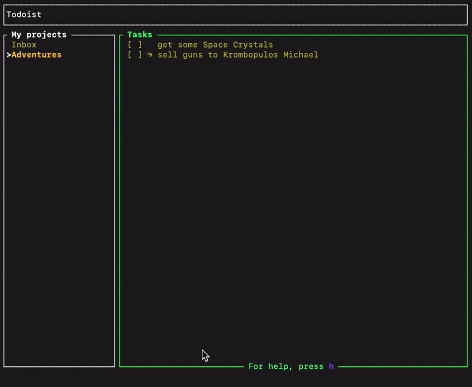

# Todoist Terminal Client

This is a terminal client for Todoist, (inspired by Spotify-TUI). The project is designed to be a keyboard-driven interface for managing your Todoist tasks directly from your terminal.

  

## Implemented Features

- View and manage your Todoist tasks and projects.
- Create new tasks with due dates and descriptions.
- Edit existing tasks.

## Installing

Run `cargo install --path . --locked` to install `todoist` to path

## Contributing

Contributions are welcome! Please feel free to submit a pull request.

## Disclaimer

This project is a personal project and is not affiliated with, maintained, authorized, endorsed or sponsored by the Todoist company or any of its affiliates.
